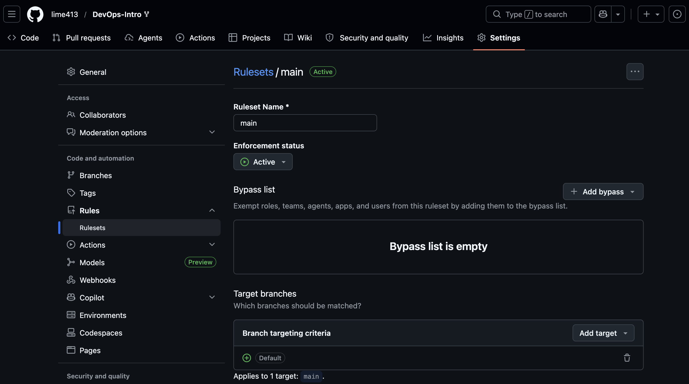
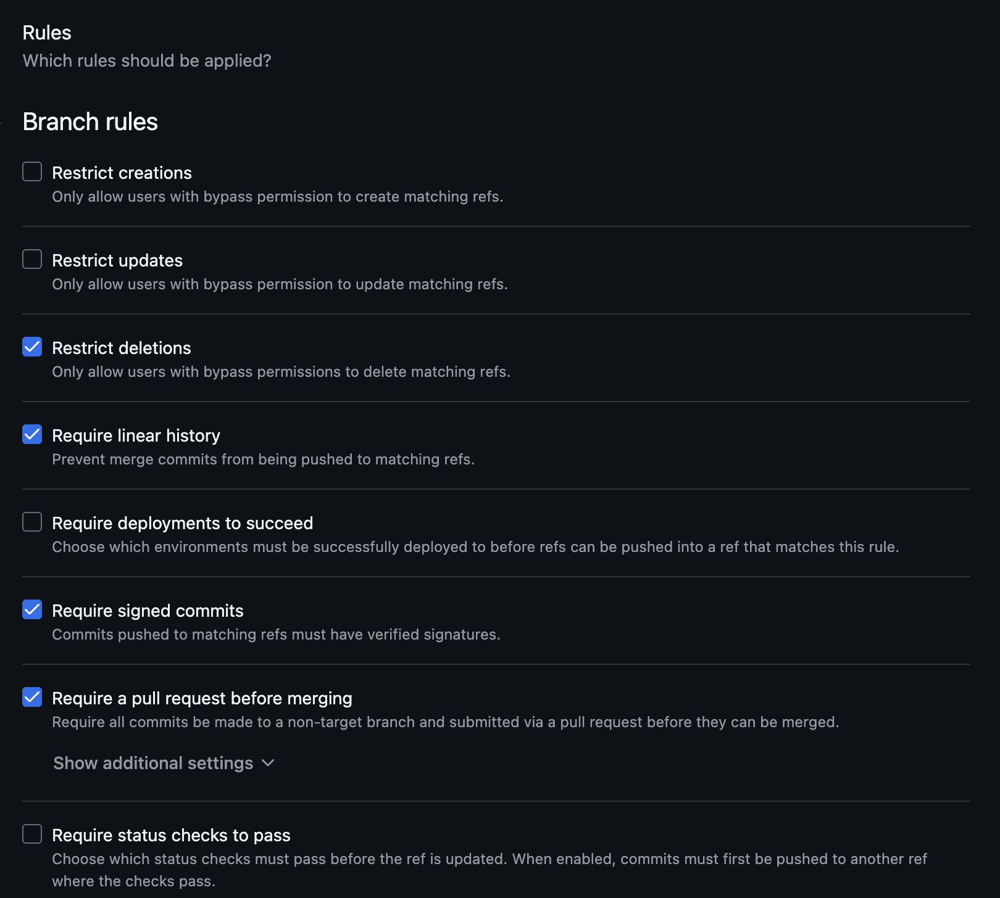
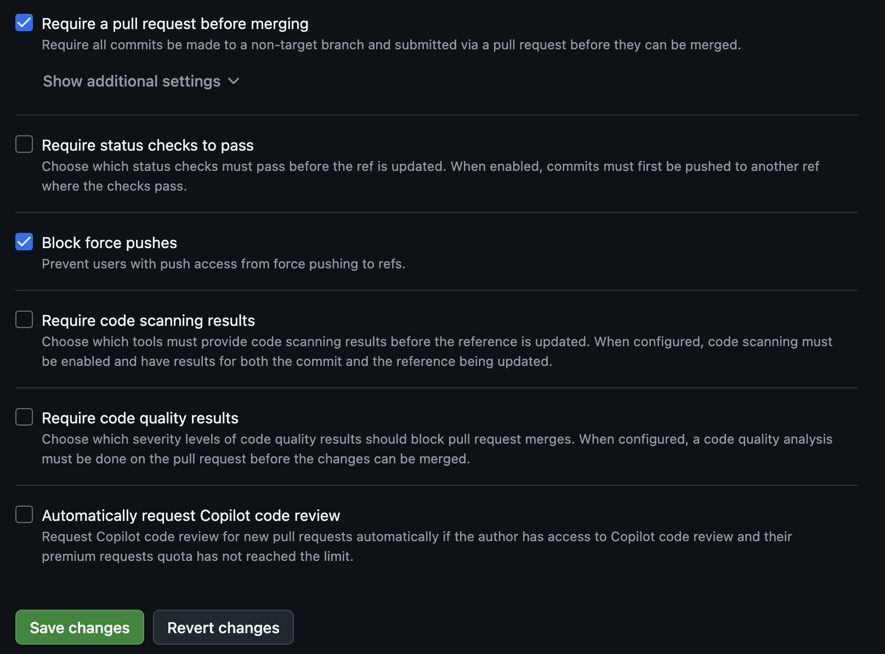

# Lab 1 submission

## Task 1 - SSH Commit Signing and QuickNotes

### Working app

`id` of new note is 6, not 5, because I didn't save the output first time, so I deleted note with `id` = 5 and created note again.

```
tatyana@Tatyanas-MacBook-Air DevOps-Intro % curl -s http://localhost:8080/health | python3 -m json.tool
{
    "notes": 4,
    "status": "ok"
}
tatyana@Tatyanas-MacBook-Air DevOps-Intro % curl -s http://localhost:8080/notes  | python3 -m json.tool
[
    {
        "id": 3,
        "title": "DevOps mantra",
        "body": "If it hurts, do it more often.",
        "created_at": "2026-01-15T10:10:00Z"
    },
    {
        "id": 4,
        "title": "Endpoint cheat-sheet",
        "body": "GET /notes  GET /notes/{id}  POST /notes  DELETE /notes/{id}  GET /health  GET /metrics",
        "created_at": "2026-01-15T10:15:00Z"
    },
    {
        "id": 1,
        "title": "Welcome to QuickNotes",
        "body": "This is the project you'll containerize, deploy, monitor, and harden across all 10 labs.",
        "created_at": "2026-01-15T10:00:00Z"
    },
    {
        "id": 2,
        "title": "Read app/main.go first",
        "body": "Start by understanding the entry point \u2014 env vars, signal handling, graceful shutdown.",
        "created_at": "2026-01-15T10:05:00Z"
    }
]
tatyana@Tatyanas-MacBook-Air DevOps-Intro % curl -s -X POST http://localhost:8080/notes \
  -H 'Content-Type: application/json' \
  -d '{"title":"hello","body":"first POST"}' | python3 -m json.tool
{
    "id": 6,
    "title": "hello",
    "body": "first POST",
    "created_at": "2026-06-08T18:55:20.809213Z"
}
tatyana@Tatyanas-MacBook-Air DevOps-Intro % curl -s http://localhost:8080/notes  | python3 -m json.tool                               
[
    {
        "id": 1,
        "title": "Welcome to QuickNotes",
        "body": "This is the project you'll containerize, deploy, monitor, and harden across all 10 labs.",
        "created_at": "2026-01-15T10:00:00Z"
    },
    {
        "id": 2,
        "title": "Read app/main.go first",
        "body": "Start by understanding the entry point \u2014 env vars, signal handling, graceful shutdown.",
        "created_at": "2026-01-15T10:05:00Z"
    },
    {
        "id": 3,
        "title": "DevOps mantra",
        "body": "If it hurts, do it more often.",
        "created_at": "2026-01-15T10:10:00Z"
    },
    {
        "id": 4,
        "title": "Endpoint cheat-sheet",
        "body": "GET /notes  GET /notes/{id}  POST /notes  DELETE /notes/{id}  GET /health  GET /metrics",
        "created_at": "2026-01-15T10:15:00Z"
    },
    {
        "id": 6,
        "title": "hello",
        "body": "first POST",
        "created_at": "2026-06-08T18:55:20.809213Z"
    }
]
```

### Good signature

```
tatyana@Tatyanas-MacBook-Air DevOps-Intro % git log --show-signature -1
commit 9f5505671af16c37cea05a4e928945741791031f (HEAD -> feature/lab1, origin/feature/lab1)
Good "git" signature for limefox413@gmail.com with ED25519 key SHA256:uILBmFloXYwLzB7ZEV76znUjoz28KKEF7OZWNJr7Jio
Author: Tatyana Shmykova <limefox413@gmail.com>
Date:   Mon Jun 8 21:49:08 2026 +0300

    docs(lab1): start submission
    
    Signed-off-by: Tatyana Shmykova <limefox413@gmail.com>
```

### Verified badge


### Why signed commits matter

Signed commits matter because they prove that a commit was created with a trusted private key and was not changed after signing. In the xz-utils case in March 2024, malicious code was added through a trusted open source project, so strong identity checks would help reviewers see who made sensitive changes. Signing does not make code safe by itself, but it adds an important layer of trust and accountability.

## Task 2 - Pull Request Template and First PR

### PR template

I added `.github/pull_request_template.md` to the `main` branch of my fork. After that I opened a PR from `feature/lab1` to `main` in my fork, and GitHub loaded the template sections.

### PR to my fork

```
## Goal
Merge my Lab 1 work into the main branch of my fork.

## Changes
- Added `submissions/lab1.md` with Lab 1 results
- Added QuickNotes curl outputs for `/health`, `/notes`, and `POST /notes`
- Added signed commit verification output and Verified badge screenshot
- Added GitHub Community explanation

## Testing
Verified QuickNotes locally with curl commands.
Verified commit signing with `git log --show-signature -1`.
Checked that GitHub shows the commit as Verified.

## Checklist
- [x] Title is a clear sentence (<= 70 chars)
- [x] Commits are signed (`git log --show-signature`)
- [x] `submissions/labN.md` updated
```

### PR to the course repository

For the PR to the course repository, the template was inserted manually. GitHub did not auto-populate it because the base repository is `inno-devops-labs/DevOps-Intro`, so GitHub looks for the template in the course repository, not in my fork.

```
## Goal
Submit Lab 1 to the course repository.

## Changes
- Added my Lab 1 submission file
- Included QuickNotes curl outputs
- Included SSH signed commit verification
- Included Verified badge screenshot
- Included GitHub Community section

## Testing
Ran QuickNotes locally and checked required endpoints with curl.
Verified that my commits are signed and shown as Verified on GitHub.
Created and merged a PR into my fork first, so the PR template was loaded from my fork's `main`.

## Checklist
- [x] Title is a clear sentence (<= 70 chars)
- [x] Commits are signed (`git log --show-signature`)
- [x] `submissions/labN.md` updated
```

## Task 3 - GitHub Community

I starred the course repository and the `simple-container-com/api` repository. I also followed the professor, TAs, and several classmates on GitHub.

Starring repositories matters in open source because it helps people save useful projects, shows interest in the project, and gives maintainers more visibility. Following developers helps in team projects and professional growth because you can see their work, learn from their activity, and stay connected with classmates or future collaborators.

## Bonus Task - Branch Protection and Required Signed Commits

### Branch protection rule





### Unsigned push rejection

### Reflection
