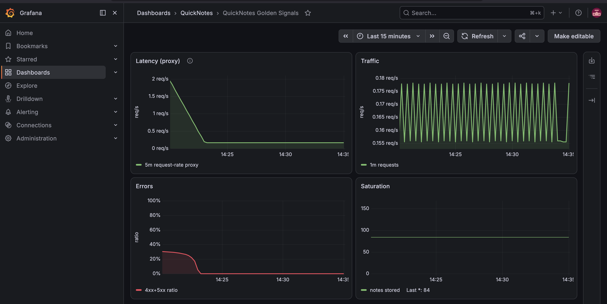
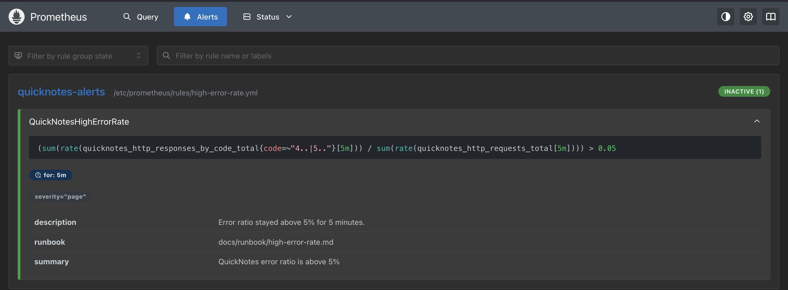
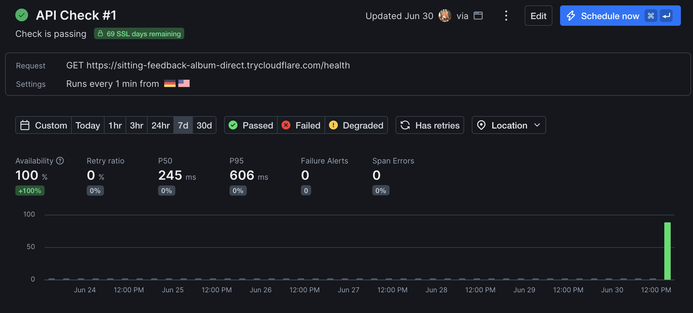
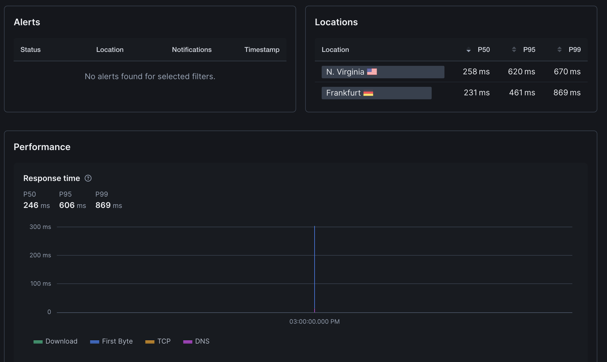

# Lab 8 Submission

## Task 1

### Monitoring Files

- [monitoring/prometheus/prometheus.yml](/Users/tatyana/Documents/DevOps-Intro/monitoring/prometheus/prometheus.yml)
- [monitoring/prometheus/rules/high-error-rate.yml](/Users/tatyana/Documents/DevOps-Intro/monitoring/prometheus/rules/high-error-rate.yml)
- [monitoring/grafana/provisioning/datasources/datasource.yml](/Users/tatyana/Documents/DevOps-Intro/monitoring/grafana/provisioning/datasources/datasource.yml)
- [monitoring/grafana/provisioning/dashboards/dashboard.yml](/Users/tatyana/Documents/DevOps-Intro/monitoring/grafana/provisioning/dashboards/dashboard.yml)
- [monitoring/grafana/dashboards/golden-signals.json](/Users/tatyana/Documents/DevOps-Intro/monitoring/grafana/dashboards/golden-signals.json)
- [compose.yaml](/Users/tatyana/Documents/DevOps-Intro/compose.yaml)

### Dashboard Screenshot



Useful page:

```text
http://localhost:3000/d/quicknotes-golden-signals/quicknotes-golden-signals
```

Login:

```text
user: quicknotes_admin
password: lab8-observability
```

### Prometheus Target Health

```text
$ curl -sS http://127.0.0.1:9090/api/v1/targets | jq '.data.activeTargets[].health'
"up"
```

### Provisioned Dashboard Check

```json
[
  {
    "uid": "quicknotes-golden-signals",
    "title": "QuickNotes Golden Signals",
    "type": "dash-db",
    "tags": [
      "golden-signals",
      "quicknotes"
    ]
  }
]
```

### Traffic Generation Notes

I generated mixed traffic against QuickNotes after startup:
- healthy `GET /notes`
- healthy `GET /health`
- valid `POST /notes`
- invalid `POST /notes` with malformed JSON
- `GET /notes/9999` for 404s

That produced non-trivial metrics:

```text
quicknotes_http_requests_total 418
quicknotes_http_responses_by_code_total{code="200"} 256
quicknotes_http_responses_by_code_total{code="201"} 80
quicknotes_http_responses_by_code_total{code="400"} 48
quicknotes_http_responses_by_code_total{code="404"} 34
quicknotes_notes_total 84
```

### Design Answers

#### a) Pull vs push

Prometheus pulls metrics, so Prometheus must be able to reach QuickNotes over the network. QuickNotes does not send anything out by itself.

If Prometheus cannot reach QuickNotes, the scrape fails and the target becomes unhealthy. The usual symptom is `up == 0` or a failed target in the Prometheus UI.

#### b) Why `scrape_interval: 15s`

If I set it to `5s`, Prometheus stores more samples, uses more CPU and disk, and short spikes look noisier. Queries such as `rate()` become more expensive because there are more points to process.

If I set it to `5m`, I lose detail. Short incidents can disappear between scrapes, dashboards look stair-stepped, and alerting reacts too slowly.

#### c) `rate()` vs `irate()` vs `delta()`

`rate()` is the right choice for the Traffic panel because it gives a stable per-second average over a window and works well for counters.

`irate()` is more sensitive to the last two samples, so it is better for very short spikes but noisier for dashboards. `delta()` shows raw change over a range and is not the normal choice for request traffic panels.

#### d) Why provision Grafana from files

Provisioning from files makes the dashboard reproducible. A fresh `docker compose up` loads the same datasource and the same dashboard every time.

That matters for version control, review, and disaster recovery. Nobody has to rebuild the dashboard by hand after deleting containers or moving to another machine.

## Task 2

### Alert Rule

See [monitoring/prometheus/rules/high-error-rate.yml](/Users/tatyana/Documents/DevOps-Intro/monitoring/prometheus/rules/high-error-rate.yml).

The rule:
- fires when error ratio is above 5%
- requires the condition to stay true for 5 minutes
- adds `severity: page`
- links to [docs/runbook/high-error-rate.md](/Users/tatyana/Documents/DevOps-Intro/docs/runbook/high-error-rate.md)

### Alert Timeline

Initial rule state:

```text
--- 2026-06-30T11:11:14Z ---
state=inactive health=ok
```

Pending state:

```text
--- 2026-06-30T11:12:14Z ---
state=pending health=ok
alert_state=pending activeAt=2026-06-30T11:11:04.682872047Z value=1.9396705073286885e-01
```

Firing state:

```text
--- 2026-06-30T11:17:15Z ---
state=firing health=ok
alert_state=firing activeAt=2026-06-30T11:11:04.682872047Z value=3.142201834862385e-01
```

Current alert API output:

```json
{
  "state": "firing",
  "activeAt": "2026-06-30T11:11:04.682872047Z",
  "value": "3.1473214285714285e-01",
  "labels": {
    "alertname": "QuickNotesHighErrorRate",
    "severity": "page"
  },
  "annotations": {
    "description": "Error ratio stayed above 5% for 5 minutes.",
    "runbook": "docs/runbook/high-error-rate.md",
    "summary": "QuickNotes error ratio is above 5%"
  }
}
```

### Alert Screenshot



Useful page:

```text
http://localhost:9090/alerts
```

### Runbook

See [docs/runbook/high-error-rate.md](/Users/tatyana/Documents/DevOps-Intro/docs/runbook/high-error-rate.md).

### Design Answers

#### e) Why "sustained for 5 minutes"

One bad request does not mean users are in trouble. Short spikes, bots, and test traffic can create brief errors that fix themselves.

The 5-minute hold reduces noise and pages only when the service is really degraded for a meaningful period.

#### f) Symptom alerts vs cause alerts

This alert is a symptom alert because it watches what users feel: error responses. A cause alert example would be something like "notes_total is above 100" or "container restarted once".

That is worse because the cause might not actually hurt users. A page should start from impact, not from every low-level event that might be harmless.

#### g) Alert fatigue threshold

If an alert pages me and users were not actually affected more than about 20% of the time, I would call it too noisy. At that point the team starts learning to ignore it, which is more dangerous than having fewer alerts.

The exact number depends on the service, but a page that is false or non-actionable one time out of five is already a problem.

## Bonus Task

### Internal Probe Setup

To make the internal-vs-external comparison honest, I added a Prometheus blackbox probe inside the Compose network:

- [monitoring/blackbox/blackbox.yml](/Users/tatyana/Documents/DevOps-Intro/monitoring/blackbox/blackbox.yml)
- internal probe job `quicknotes-blackbox` in [monitoring/prometheus/prometheus.yml](/Users/tatyana/Documents/DevOps-Intro/monitoring/prometheus/prometheus.yml)
- `blackbox-exporter` service in [compose.yaml](/Users/tatyana/Documents/DevOps-Intro/compose.yaml)

Current internal probe health:

```text
job=quicknotes-blackbox
health=up
scrapeUrl=http://blackbox-exporter:9115/probe?module=http_2xx&target=http%3A%2F%2Fquicknotes%3A8080%2Fhealth
```

### Internal Baseline

Current internal 5-minute latency and success values from Prometheus:

```text
p50 = 0.0029269985 s
p95 = 0.00311179955 s
success ratio = 1
```

### External Probe

I exposed QuickNotes through Cloudflare Tunnel at:

```text
https://sitting-feedback-album-direct.trycloudflare.com/health
```

Then I created a Checkly API check with:
- method `GET`
- frequency `1 minute`
- locations `Frankfurt` and `N. Virginia`
- alert on non-`200` responses and slow responses

Screenshots:





### Comparison Table

Fill this after the external run finishes:

| | Prometheus (inside the Compose net) | Checkly (from 2 regions) |
|--|---|---|
| Avg latency p50 | 0.0029269985 s | 0.246 s |
| Avg latency p95 | 0.00311179955 s | 0.606 s |
| Errors observed | 0 during internal probe window | 0 |

### Comparison Notes

Checkly can catch failures that happen between the internet and my machine, for example tunnel outages, public DNS problems, TLS issues, or regional internet routing problems. Prometheus inside the Compose network would miss those because it only sees the service from the inside.

Prometheus can catch failures that are visible only on the internal path, such as a bad scrape target, a broken metrics endpoint, or fast internal state changes that happen more often than the external probe frequency. Checkly would miss those because it polls less often and only through the public health endpoint.

The external latency is much higher than the internal latency, which is expected. The internal probe stayed around a few milliseconds, while the external probe was a few hundred milliseconds because it includes the public network path and the Cloudflare tunnel.
